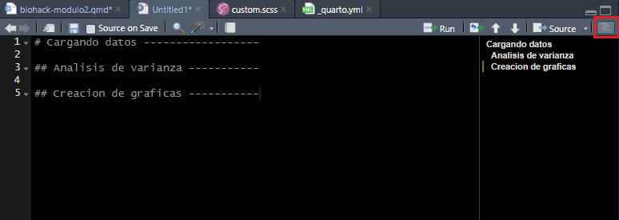
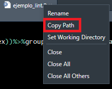
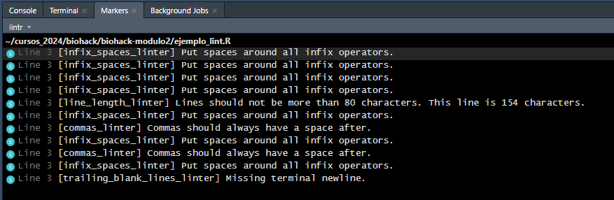
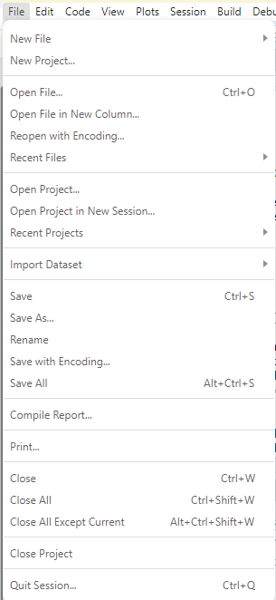
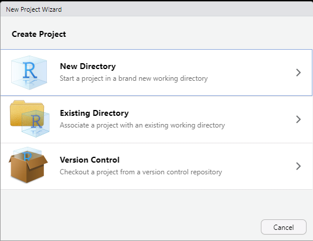
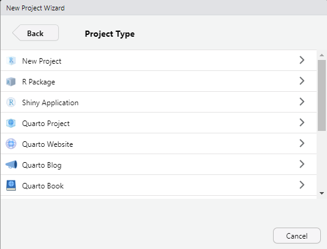
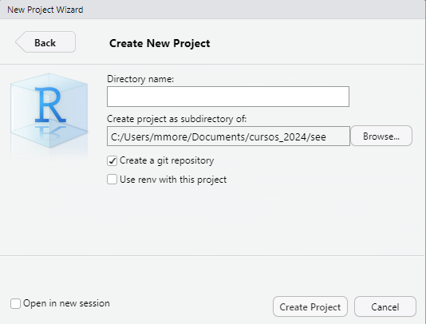
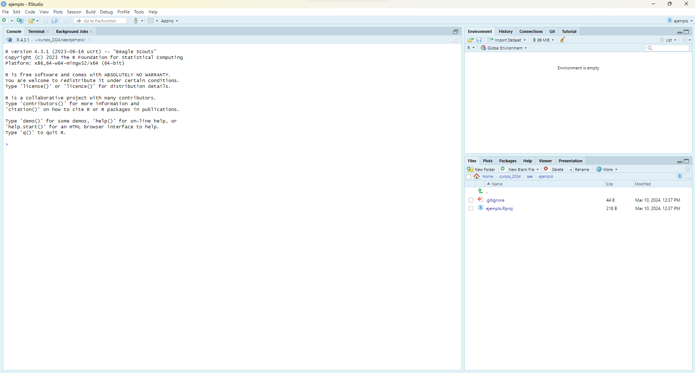
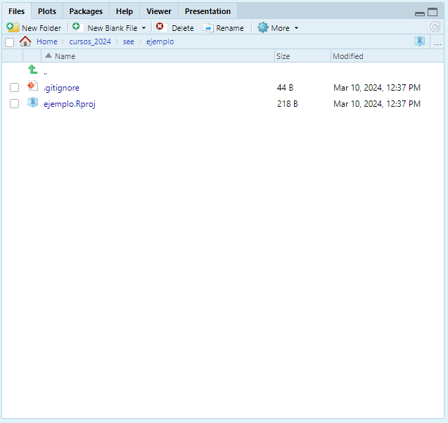

## 

::: columns
::: {.column width="37.5%"}
{style="margin-left:-40px"}
:::

::: {.column width="60%"}
::: {.title data-id="title"}
Módulo 2: Proyectos en R y buenas prácticas de programación
:::

Mauricio Moreno, PhD
:::
:::

{.image-left}

<!-- https://unsplash.com/photos/train-rail-near-brown-building-during-daytime-yRvYmE7WVec?utm_content=creditShareLink&utm_medium=referral&utm_source=unsplash -->

## Introducción {.smaller}

::: columns
::: {.column width="60%"}
::: incremental
-   ¿Cómo comenzaste tu aprendizaje de R? 

    -   Quizá este curso sea tu primera experiencia con R

    -   Para otros (incluyéndome), fue parte de algún curso de estadística

    -   O te viste forzado a aprenderlo por un trabajo (en la marcha incluso)

-   Independientemente del estilo de programación que forjes, a la larga es común que tus scripts:

    -   Terminen conteniendo miles de líneas

    -   Estén por todos lados en tu computador

    -   Que te sea difícil compartirlos, porque apenas si tú los entiendes
:::
:::

::: {.column width="37.5%"}
:::
:::

{.image-right}

## ¿Por qué evitar esto?

::: incremental
-   Escribir buen código nos ayuda a nosotros mismos (en el futuro)

-   Ya sea en el ambiente laboral o académico:

    -   Al compartirlo, se puede evitar duplicación de esfuerzos

    -   Nos permite reproducir de manera más fácil los resultados obtenidos

    -   Facilita la corrección de errores que hayamos podido cometer
:::

# Comenzando por nuestros scripts

## Añadiendo comentarios {.smaller}

::: incremental
-   Podemos añadir comentarios usando `#`

-   Se aconseja que un comentario **no explique** que es lo que hace el código,

-   Sino, **por qué** lo hiciste
:::

. . .

::: columns
::: {.column width="50%"}
```{r}
#| eval: false
#| echo: true

library(palmerpenguins) 

penguins %>%
  group_by(species) %>%
  filter(!is.na(sex)) %>% # filtrar NAs
  summarise(
    media_body = mean(body_mass_g, na.rm = T), # calc. media peso
    sd_body = sd(body_mass_g, na.rm = T), # cal. desv. est. peso
  )

```
:::

::: {.column width="50%"}
```{r}
#| eval: false
#| echo: true

# Remueve los valores perdidos de la 
# variable sex y calcula la media aritmetica
# y desviacion estandar de body_mass_g
# usando la tabla penguins de la libreria
# palmerpenguins

library(palmerpenguins)

penguins %>%
  group_by(species) %>%
  filter(!is.na(sex)) %>% 
  summarise(
    media_body = mean(body_mass_g, na.rm = T), 
    sd_body = sd(body_mass_g, na.rm = T), 
  )

```
:::
:::

. . .

Notarás que la forma de la derecha parece un poco tediosa de redactar para cada paso que des en tu análisis. Sin embargo, piensa en ti mismo leyendo tu código en unos cuantos meses en el futuro 😉

## Secciones y subsecciones

::: columns
::: {.column width="50%"}
Una ventaja de RStudio es que podemos añadir secciones y subsecciones a nuestro código

```{r}
#| eval: false
#| echo: true

# Cargando datos ------------------

## Analisis de varianza -----------

## Creacion de graficas -----------
```
:::

::: {.column width="50%"}
{fig-align="center"}
:::
:::

## Código legible

Esta línea de código corre sin errores, pero...

```{r}
#| eval: false
#| echo: true

penguins%>%filter(!is.na(sex))%>%group_by(species, island)%>%summarise(obs=n(body_mass_g),media=mean(body_mass_g),desv.std=sd(body_mass_g))
```

. . .

¿No es más facil leer esto?

```{r}
#| eval: false
#| echo: true

penguins %>% 
  filter(!is.na(sex)) %>% 
  group_by(species, island) %>% 
  summarise(obs = n(body_mass_g), 
            media = mean(body_mass_g), 
            desv.std = sd(body_mass_g))
```

## Linting {.smaller}

::: incremental

-   ***Linting***, desde el punto de vista de la programación, es una expresión en Inglés que se puede traducir al Español como la práctica de estilizar código (***linting*** en Español se traduce literalmente a ***pelusa*** ¯\\*(ツ)*/¯)

-   Cómo estilicemos nuestro código es algo ya personal, sin embargo existen varias "convenciones" que nos pueden guiar a tener códigos más legibles, algunas de ellas:

    -   Deja espacios vacíos antes y despues de `=`, `<-`, `-`, `+`, `%>%` etc
    
    -   Un espacio vacío después de `,`

    -   Da cortes de línea (enter) donde sea necesario para que las líneas de código no sean muy largas

    -   Deja un espacio vacío entre líneas o conjuntos de líneas que cumplen con una función específica.

-   Estas y otras convenciones las puedes llevar a cabo a mano, o en R, puedes ayudarte de las librerías `{lintr}` y `{styler}`.
:::

## {lintr} {.smaller}

::: incremental

1.    Comenzaremos instalando `{lintr}`: `install.packages("lintr")`

2.    En nuevo script en tu sesión de R, copia el siguiente código y guárdalo bajo el nombre "ejemplo_lint.R"

:::

. . .

```{r}
#| echo: true
#| eval: false
library(palmerpenguins)
tabla_resumen<-penguins%>%filter(!is.na(sex))%>%group_by(species, island)%>%summarise(obs=n(body_mass_g),media=mean(body_mass_g),desv.std=sd(body_mass_g))
```

::: incremental

3.    Sobre la pestaña con el nombre de tu script, haz click derecho y copia el *path*

:::

. . .

{fig-align="center"}

::: incremental

4.    En la consola de R, carga la librería `{lintr}`, y ejecuta el comando `lint` pegando entre comillas el *path* que acabas de copiar, en mi caso:

:::

. . .

```{r}
#| echo: true
#| eval: false
library(lintr)
lint("C:/Users/mmore/Documents/cursos_2024/biohack/biohack-modulo2/ejemplo_lint.R")
```

## {lintr} {.smaller visibility="uncounted"}

5.    Al ejecutar esas líneas, te aparecerá una nueva pestaña junto a tu consola llamada *Markers*. Ahí, estarán las correcciones de estilo sugeridas por `{lintr}`

{fig-align="center"}

## {styler}

-   Como viste, `{lintr}` solamente te sugiere los cambios a realizar para mejorar el estilo de tu código.

-   Al contrario, `{styler}` lleva a cabo la mayoría de las sugerencias de `{lintr}` por ti

::: incremental

1.    Instalamos `{styler}`: `install.packages("styler")`

2.    En la consola, ejecutamos algo similar a lo que hicimos con `{lintr}`

:::

. . .

```{r}
#| echo: true
#| eval: false
library(styler)
style_file("C:/Users/mmore/Documents/cursos_2024/biohack/biohack-modulo2/ejemplo_lint.R")
```

. . .

3.    Ahora tu script debe estar estilizado!


## Modularizando tus scripts {.smaller}

Imagina que tu trabajo puede comenzar con una carpeta cuya estructura se ve más o menos así:

```{r}
#| eval: false
#| code-line-numbers: false
#| echo: true
tesis
│   analisis datos.R
│   datos tesis.xlsx
```

. . .

Esto está bien en un principio, pero

::: incremental

-   A medida que agregues más análisis en tu script, puedes fácilmente terminar con miles de líneas de código.

-   En este caso, ya ni las secciones y subsecciones ayudan mucho para navegarlo.

-   En tu script, seguramente llevas a cabo múltiples cosas (cargar y limpiar datos, crear modelos, generar figuras...)

-   Puedes entonces pensar en modularizarlo!

:::

. . .

El modularizar un script consiste simplemente en dividirlo en múltiples scripts de menor tamaño basándote en las tareas que realizas en tu código.


<!-- . . . -->

<!-- Pero tras varias revisiones de tu director/jefe/cliente puedes terminar con algo como -->

<!-- ```{r} -->
<!-- #| eval: false -->
<!-- #| code-line-numbers: false -->
<!-- #| echo: true -->
<!-- tesis -->
<!-- │   analisis capitulo 3.R -->
<!-- │   analisis capitulo 3 esta vez si.R -->
<!-- │   analisis capitulo 4.R -->
<!-- │   borrador tesis 1.docx -->
<!-- │   correccion primer analisis.R -->
<!-- │   datos tesis.xlsx -->
<!-- │   datos tesis corregidos.xlsx -->
<!-- │   imagen resultado 1.png -->
<!-- │   imagen resultado 2.png -->
<!-- ``` -->


## Modularización

Este bien podría ser el flujo de trabajo más simple que podriamos imaginarnos:

```{mermaid}
flowchart LR
    A[Cargar librerías] --> B[Cargar datos]
    B --> C[Limpiar datos]
    C --> D[Análisis Exploratorio]
    D --> E[Estadísticos Descriptivos]
    E --> F[Modelo Estadístico]
    F --> G[Resultados Finales]
```

. . .

Sin embargo, para trabajos sencillos, un flujo tan detallado no hace falta (excepto si tu código va a ser usado para *producción*). Entonces, también podríamos tener:

```{mermaid}
flowchart LR
    A[Cargar librerías<br>Cargar datos<br>Limpiar datos] --> B[Análisis Exploratorio]
    B --> C[Estadísticos Descriptivos]
    C --> D[Modelo Estadístico]
    D --> E[Resultados Finales]
```

. . .

En resumen, al modularizar tu código, las decisiones que tomes dependerán por supuesto de las necesidades de tu problema y tu estilo de programación.

## Nombrando tus módulos

::: columns
::: {.column width="50%"}

Una opción:

```{r}
#| eval: false
#| code-line-numbers: false
#| echo: true
tesis
│   carga limpieza datos.R
│   librerias y funciones.R
│   estadisticos descriptivos.R
│   estadisticos inferenciales.R
│   analisis exploratorio.R
│   tablas y figuras.R
│   datos tesis.xlsx
```


:::


::: {.column .fragment width="50%"}
Una **mejor** opción:

```{r}
#| eval: false
#| code-line-numbers: false
#| echo: true
tesis
│   00_librerias_funciones.R
│   01_carga_limpieza_datos.R
│   02_analisis_exploratorio.R
│   03_estadisticos_descriptivos.R
│   04_estadisticos_inferenciales.R
│   05_tablas_figuras.R
│   datos_tesis.xlsx
```
:::
:::

. . .

::: {.callout-tip}
## Tips para nombrar tus archivos

-   Empieza con un prefijo numérico de dos dígitos

-   Dales nombres descriptivos

-   Evita espacios vacíos (puedes usar - ó _)

-   Evita caractéres especiales (como tildes, la letra ñ, etc) o innecesarios al contexto (como la letra "y")

:::

## Y, ¿ahora?

{fig-align="center"}

Tenemos la idea básica de modularizar, pero ahora, ¿cómo hacemos para que R sepa cómo usar nuestros módulos?

# Proyectos en R

## Introducción {.smaller}

::: incremental

-   Bajo la lógica de un solo script, es necesario el especificar en R cual es nuestro directorio de trabajo.

-   Esto se lo consigue usando el comando `setwd`  que funciona de una manera similar a estar copiando el *path* como vimos para `{lintr}` y `{styler}`.

-   Pero al modularizar, esto significaría el cambiar constantemente el *path* conforme avancemos y cambiemos cosas en nuestro trabajo en cada uno de los módulos que creemos.

-   Afortunadamente, RStudio nos ofrece la funcionalidad de trabajar bajo la modalidad de Proyectos que ofrece entre otras ventajas:

    -   No especificar repetitivamente el directorio de trabajo
    
    -   Organizar de manera más flexible la estructura de nuestro proyecto
    
    -   Poder incluso cambiar la ubicación del proyecto en nuestro computador, sin necesidad de que se comprometa su funcionamiento.

:::


## Creando un proyecto {.smaller}

::: columns
::: {.column width="40%"}
{fig-align="center"}
:::

::: {.column width="60%"}
1.    Click en *File* (Archivo)
    
2.    Click en *New Project...* (Nuevo proyecto...)
:::
:::


## Creando un proyecto {visibility="uncounted" .smaller}

::: columns
::: {.column width="40%"}
{fig-align="center"}
:::

::: {.column width="60%"}
1.    Click en *File* (Archivo)
    
2.    Click en *New Project...* (Nuevo proyecto...)

3.    Click en *New Directory* (Nuevo Directorio)
:::
:::


## Creando un proyecto {visibility="uncounted" .smaller}

::: columns
::: {.column width="40%"}
{fig-align="center"}
:::

::: {.column width="60%"}
1.    Click en *File* (Archivo)
    
2.    Click en *New Project...* (Nuevo proyecto...)

3.    Click en *New Directory* (Nuevo directorio)

4.    Click en *New Project* (Nuevo proyecto)
:::
:::

## Creando un proyecto {visibility="uncounted" .smaller}

::: columns
::: {.column width="40%"}
{fig-align="center"}
:::

::: {.column width="60%"}
1.    Click en *File* (Archivo)
    
2.    Click en *New Project...* (Nuevo proyecto...)

3.    Click en *New Directory* (Nuevo directorio)

4.    Click en *New Project* (Nuevo proyecto)

5.    Escoger la ubicación donde crearemos el nuevo proyecto y el nombre del directorio. 
:::
:::

## Creando un proyecto {visibility="uncounted" .smaller}

{fig-align="center"}

## Creando un proyecto {visibility="uncounted" .smaller}

::: columns
::: {.column width="40%"}
{fig-align="center"}
:::

::: {.column width="60%"}
-   En la pestaña de *Files* (Archivos) es donde podremos poner en práctica la organización de nuestro proyecto.
:::
:::

## Conectando nuestros módulos {.smaller}

Ahora que hemos creado nuestro primer proyecto, vamos por un ejemplo básico de cómo conectar los módulos.

. . .

1.    Supongamos que vamos a hacer un análisis de los datos de los Pingüinos de Palmer. Sin adentrarme mucho en el código, crea un script de nombre "00_librerias_funciones.R" con el siguiente contenido:

```{r}
#| echo: true
#| eval: false
if (!require("rlang")) install.packages("rlang")

library(palmerpenguins)
library(ggplot2)
library(dplyr)
library(rlang)

# Funcion para plotear el largo vs la profundidad del pico por sexo
# Añade una linea de regresión a los puntos
# Argumentos: especie = especie de pinguino; isla = isla donde vive la especie

plt_function <- function(especie, isla){
  penguins %>%
    filter(species == parse_expr(especie) & island == parse_expr(isla)) %>%
    filter(!is.na(sex)) %>%
    ggplot(aes(x = bill_length_mm, y = bill_depth_mm)) +
    geom_smooth(method = "lm", formula = y ~ x) + 
    geom_point() +
    facet_wrap(~ sex, scales = "free_x") +
    theme_bw()+
    labs(title = "Largo de pico vs. profundidad de pico",
         subtitle = paste0("Especie: ", especie, ". Isla: ", isla),
         x = "largo (mm)", y = "profundidad (mm)")
}
```

## Conectando nuestros módulos {.smaller}

2.    Ahora, en un script aparte de nombre "01_figuras.R", llamaremos al script que creamos anteriormente usando el comando `source`

```{r}
#| echo: true
#| eval: false
source("00_librerias_funciones.R")

# Creando plots --------------------------

## Adelie --------------------------------

### Torgersen ----------------------------

plt_function("Adelie", "Torgersen")

### Biscoe -------------------------------

plt_function("Adelie", "Biscoe")

### Dream --------------------------------

plt_function("Adelie", "Dream")
```

. . . 

3.    Ejecuta el script "01_figuras.R"

## La magia de `source` {.smaller}

::: incremental

-   `source` es el conector que necesitamos para relacionar nuestros scripts modularizados.

-   Generalmente el script con prefijo "00" es el que nos ayudará a contener pasos fundamentales. En este ejemplo, he puesto una función sencilla para automatizar un proceso.

    -   Esto es común en la industria, pero para fines académicos y/o de uso a menor escala no es tan necesario. Por esa razón no cubrimos en el curso la creación de funciones.
    
    -   En los casos más sencillos, recomiendo el usar el prefijo "00" para el script donde lleves a cabo limpieza de datos.

-   Así, si cambias algo en tus tablas originales de datos, y si has interconectado correctamente tus módulos, puedes hacer que esos cambios en los datos sean tomados en cuenta en todos tus productos de análisis.

:::

. . .

::: {.callout-note}
Cuando la organización de tu flujo de trabajo es muy complicada, `source` puede llegar a fallar. En ese caso, te recomiendo darle un vistazo al paquete [`{here}`](https://here.r-lib.org/){target="_blank"}
:::


## Organizando aún más {.smaller} 

::: columns
::: {.column width="50%"}
```{r}
#| eval: false
#| code-line-numbers: false
#| echo: true
tesis
│   tesis.Rproj
│   00_librerias_funciones.R
│   01_carga_limpieza_datos.R
│   02_analisis_exploratorio.R
│   03_estadisticos_descriptivos.R
│   04_estadisticos_inferenciales.R
│   05_tablas_figuras.R
│   datos_tesis.xlsx
│   dispersion_a.png
│   dispersion_b.png
│   dispersion_c.png
│   tabla_anova_a.docx
│   tabla_anova_b.docx
│   tabla_anova_c.docx
```
:::

::: {.column .fragment width="50%"}
```{r}
#| eval: false
#| code-line-numbers: false
#| echo: true
tesis
│   tesis.Rproj
└───datos
│   │   datos_tesis.xlsx
└───figuras
│   │   dispersion_a.png
│   │   dispersion_b.png
│   │   dispersion_c.png
└───R
│   │   00_librerias_funciones.R
│   │   01_carga_limpieza_datos.R
│   │   02_analisis_exploratorio.R
│   │   03_estadisticos_descriptivos.R
│   │   04_estadisticos_inferenciales.R
│   │   05_tablas_figuras.R
```
:::
:::

# Antes de terminar

## Guarda la huella digital de tu trabajo

::: incremental

-   Es común que con nuevas versiones de paquetes, algunas funciones son dadas de baja.

-   Los paquetes pueden también ser dados de baja del CRAN.

-   Esto puede producir que de aquí a un par de años un código tuyo simplemente no funcione.

-   Para facilitar el trabajo detectivesco de encontrar las versiones exactas que usaste para tu análisis, al terminar un proyecto, guarda la información de la sesión de R.

:::

. . . 

```{r}
#| eval: false
#| code-line-numbers: false
#| echo: true
writeLines(capture.output(sessionInfo()), "sessionInfo.txt")
```


## Conflictos {.smaller}

::: incremental

-   Habiendo miles de paquetes, es común que a veces algunos utilicen los mismos nombres para sus funciones.

-   Cuando esto ocurre, R te lo dejará saber al cargar un paquete con un mensaje similar a esto

:::

. . .

```{r}
#| echo: true
#| eval: false
#| code-line-numbers: false
> library(dplyr)

Attaching package: ‘dplyr’

The following objects are masked from ‘package:stats’:

    filter, lag

The following objects are masked from ‘package:base’:

    intersect, setdiff, setequal, union

```

. . .

-   Si vas a usar las funciones de un paquete pocas veces, es recomendable llamar a las funciones de manera directa sin cargar el paquete en su totalidad. Esto se consigue usando el comando `::`

```{r}
#| echo: true
#| eval: false
#| code-line-numbers: false
tidyr::pivot_longer()
```

## R es un lenguaje extraño
:::incremental
-   ¿Recuerdas que algún momento mencioné que hay que evitar nombrar nuestros objetos de R con nombres de funciones de otros paquetes?

-   Si creamos una función del mismo nombre que `mean`, que haga cualquier otra cosa excepto calcular la media aritmética

:::

. . .

```{r}
#| echo: true
#| eval: false
#| code-line-numbers: false
mean <- function(vector){
  return(print(vector))
}
```

. . .

-   Enmascara en tu sesión a la función base `mean` verdadera. Esto no sucede en otros lenguajes de programación.

## {}

::: columns
::: {.column width="60%"}

::: {.title data-id="title"}
Fin del módulo 2
:::

::: {.callout-tip}
## Créditos

Este módulo está basado en una buena extensión en la charla [***Stop making spaghetti (code)***](https://nrennie.rbind.io/talks/useR-spaghetti-code/slides.html#/section){target="_blank"} de la [Prof. Nicola Rennie, PhD](https://nrennie.rbind.io/){target="_blank"}

Foto portada por <a href="https://unsplash.com/@patwhelen?utm_content=creditCopyText&utm_medium=referral&utm_source=unsplash">Pat Whelen</a> en <a href="https://unsplash.com/photos/train-rail-near-brown-building-during-daytime-yRvYmE7WVec?utm_content=creditCopyText&utm_medium=referral&utm_source=unsplash">Unsplash</a>
  

Foto final por <a href="https://unsplash.com/@hongkyu?utm_content=creditCopyText&utm_medium=referral&utm_source=unsplash">PARK HONG KYU</a> en <a href="https://unsplash.com/photos/white-and-black-boat-on-sea-during-sunset-f7efwMH5esE?utm_content=creditCopyText&utm_medium=referral&utm_source=unsplash">Unsplash</a>

:::

:::

::: {.column width="37.5%"}

{style="margin-left:125px"}


:::
:::

{.image-right}